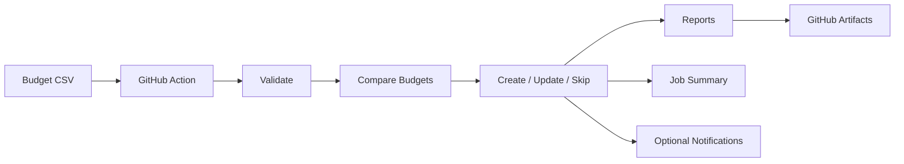

# GitHub Copilot Budget Guardian

An enterprise GitHub Action for managing and synchronizing GitHub Copilot budgets from a simple CSV configuration.

[](https://github.com/xebia-playground/GitHub-Copilot-Budget-Guardian/actions/workflows/test.yml)
[](LICENSE)

## What it does

- Synchronizes Copilot budgets
- Creates new user budgets
- Updates changed budgets
- Skips unchanged budgets
- Generates CSV, JSON, and Markdown reports
- Uploads reports as GitHub Actions artifacts
- Provides a GitHub Job Summary
- Supports optional admin notifications

## Simple Architecture Diagram



## Quick Start

```yaml
name: Copilot Budget Sync

on:
  workflow_dispatch:

permissions:
  contents: read

jobs:
  sync:
    runs-on: ubuntu-latest

    steps:
      - uses: actions/checkout@v4

      - name: Sync Copilot Budgets
        id: guardian
        uses: xebia-playground/GitHub-Copilot-Budget-Guardian@v1
        with:
          github-token: ${{ secrets.ENTERPRISE_ADMIN_PAT }}
          enterprise-slug: ${{ secrets.ENTERPRISE_SLUG }}
          budget-file: budgets.csv
          dry-run: "true"
          notify-on: changes-only

      - name: Upload Budget Reports
        uses: actions/upload-artifact@v4
        with:
          name: budget-sync-report
          path: artifacts/
          retention-days: 7
```

## Budget CSV

```csv
username,budget,team,reason
user1,5,Platform,Testing
user2,10,Engineering,Monthly budget
```

| Column | Required | Description |
|---|---|---|
| username | Yes | GitHub username |
| budget | Yes | Copilot budget value |
| team | No | Team label for reporting |
| reason | No | Business context for the budget |

## How it works

1. Read CSV.
2. Validate budgets.
3. Compare with Enterprise budgets.
4. Create, update, or skip.
5. Generate reports and job summary.

## Reports

After the workflow completes:

Actions
-> Workflow Run
-> Artifacts
-> budget-sync-report

The artifact ZIP contains:

- budget-report.csv
- budget-report.json
- budget-report.md

## Notifications

Optional notifications are available for:

- Email
- Microsoft Teams
- Slack

Notifications are intended for Enterprise Administrators and should be configured with GitHub Secrets.

For detailed setup examples, see docs/api.md.

## Secrets

| Secret | Required | Purpose |
|---|---|---|
| ENTERPRISE_ADMIN_PAT | Yes | Enterprise budget access |
| ENTERPRISE_SLUG | Yes | Enterprise identifier |
| ADMIN_NOTIFICATION_EMAILS | Optional | Admin notification recipients |
| SMTP_HOST | Optional | Email server |
| SMTP_PORT | Optional | Email server port |
| SMTP_USER | Optional | Email account |
| SMTP_PASSWORD | Optional | Email authentication |
| TEAMS_WEBHOOK | Optional | Teams notifications |
| SLACK_WEBHOOK | Optional | Slack notifications |

Notification secrets are optional.

## Dry Run

Use:

```text
dry-run: "true"
```

This previews changes without modifying Enterprise budgets. Start with dry-run before enabling live updates.

## Inputs

| Input | Required | Default | Description |
|---|---|---|---|
| github-token | Yes | - | GitHub PAT with Enterprise budget permissions |
| enterprise-slug | Yes | - | GitHub Enterprise slug |
| budget-file | No | budgets.csv | Path to budget CSV |
| dry-run | No | false | Preview mode without write operations |
| slack-webhook | No | - | Slack Incoming Webhook URL |
| teams-webhook | No | - | Microsoft Teams Incoming Webhook URL |
| notify-on | No | changes-only | Notification policy: always or changes-only |

## Outputs

| Output | Description |
|---|---|
| created | Number of budgets created |
| updated | Number of budgets updated |
| skipped | Number of budgets skipped |
| failed | Number of failed budget operations |

## Troubleshooting

- Invalid PAT permissions: verify Enterprise budget API access.
- Wrong enterprise slug: verify ENTERPRISE_SLUG.
- CSV validation failure: verify required columns and numeric budget values.
- Missing report artifact: verify upload step points to artifacts/.
- Notification configuration missing: verify optional secrets are set correctly.

## Security

- Store credentials only in GitHub Secrets.
- Never commit PATs, passwords, or webhook URLs.
- Notifications are optional.
- CI integration tests are configured to avoid sending real external notifications.

## Contributing

See CONTRIBUTING.md for contribution guidelines.

## License

MIT. See LICENSE.
