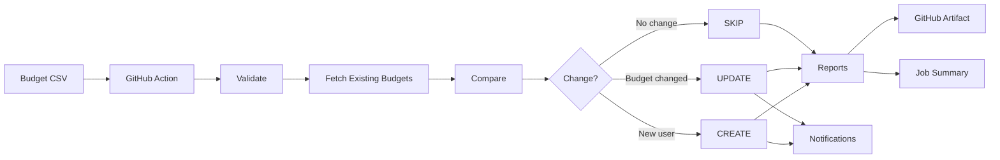

# GitHub Copilot Budget Guardian

GitHub Copilot Budget Guardian is a GitHub Action for managing GitHub Copilot enterprise budgets as code.
Define desired budgets in a CSV file, then let the Action validate data, compare with Enterprise state, apply CREATE or UPDATE changes when needed, SKIP unchanged users, generate reports, and optionally notify administrators.

[](https://github.com/xebia-playground/GitHub-Copilot-Budget-Guardian/actions/workflows/test.yml)
[](LICENSE)
[](https://github.com/xebia-playground/GitHub-Copilot-Budget-Guardian/releases)

For current repository usage before the first stable release tag, reference this Action as xebia-playground/GitHub-Copilot-Budget-Guardian@main.
After the first release tag is published, use the corresponding version tag such as @v1.

## Why use it?

Managing Copilot budgets manually is repetitive and hard to audit.
This Action makes budget operations predictable, reviewable, and repeatable in CI.

Without automation:

CSV or ticket request
-> Admin checks current budgets manually
-> Manual changes in Enterprise settings
-> Manual verification
-> Manual reporting

With GitHub Copilot Budget Guardian:

CSV
-> Validate
-> Fetch existing Enterprise budgets
-> Compare
-> CREATE / UPDATE / SKIP
-> Reports + Job Summary
-> Optional notifications



## What happens when the Action runs?

1. Reads your budget CSV file.
2. Validates usernames and budget values.
3. Fetches existing Copilot budgets from your Enterprise.
4. Compares each CSV row with current Enterprise state.
5. Applies:
   - CREATE for a user that does not yet have a budget.
   - UPDATE when an existing budget amount is different.
   - SKIP when the budget already matches.
6. Captures any per-user API failures in failed results.
7. Generates three reports in artifacts/.
8. Writes a GitHub Job Summary with totals and per-user status.
9. Sends optional Email, Teams, and Slack notifications.

## Prerequisites

- A GitHub repository where this Action runs.
- GitHub Enterprise with Copilot budget API access.
- A Personal Access Token for Enterprise budget operations.
- A budget CSV file committed to your repository.

### Token and permissions

Input github-token must be a PAT that has sufficient Enterprise permissions to read and update Copilot budgets.
If permissions are insufficient, budget fetch or update calls will fail.

## Required and optional secrets

Store secrets in GitHub Secrets.

| Secret | Required | Purpose |
|---|---|---|
| ENTERPRISE_ADMIN_PAT | Yes | Token passed to github-token |
| ENTERPRISE_SLUG | Yes | Enterprise identifier |
| ADMIN_NOTIFICATION_EMAILS | Optional | Comma-separated admin recipients for email notifications |
| SMTP_HOST | Optional | SMTP host |
| SMTP_PORT | Optional | SMTP port |
| SMTP_USER | Optional | SMTP username |
| SMTP_PASSWORD | Optional | SMTP password |
| TEAMS_WEBHOOK | Optional | Microsoft Teams webhook URL |
| SLACK_WEBHOOK | Optional | Slack webhook URL |

If optional notification secrets are missing, synchronization still completes.

## Recommended Production Flow

CSV
-> Secrets
-> Dry Run
-> Review Results
-> Download Reports
-> dry-run:false
-> Real Budget Update
-> Notifications

## Quick start

Use dry run first.

```yaml
name: Copilot Budget Sync

on:
  workflow_dispatch:

permissions:
  contents: read

jobs:
  sync:
    runs-on: ubuntu-latest

    steps:
      - uses: actions/checkout@v4

      - name: Run Budget Guardian
        id: guardian
        uses: xebia-playground/GitHub-Copilot-Budget-Guardian@main
        with:
          github-token: ${{ secrets.ENTERPRISE_ADMIN_PAT }}
          enterprise-slug: ${{ secrets.ENTERPRISE_SLUG }}
          budget-file: budgets.csv
          dry-run: "true"

      - name: Upload reports
        uses: actions/upload-artifact@v4
        with:
          name: budget-sync-report
          path: artifacts/
          retention-days: 7
```

## Budget CSV guide

### CSV format

```csv
username,budget,team,reason
alice,5,Platform,Initial rollout
bob,10,Engineering,Monthly allocation
```

| Column | Required | Description |
|---|---|---|
| username | Yes | GitHub username |
| budget | Yes | Budget value |
| team | No | Team label for reporting |
| reason | No | Reason shown in reports |

### How to add a new user

1. Add a new row to the CSV with username and budget.
2. Commit and run the workflow.
3. If the user has no existing budget, status will be CREATE.

### CREATE / UPDATE / SKIP behavior

- CREATE: no existing budget found for the username.
- UPDATE: existing budget found but amount differs.
- SKIP: existing budget amount already matches CSV.

## Dry run and real updates

### Safe testing with dry run

Set:

```text
dry-run: "true"
```

Dry run performs validation and comparison, generates reports, and outputs counts, but does not apply budget changes.

### Real budget changes

Set:

```text
dry-run: "false"
```

Then CREATE and UPDATE operations are sent to the Enterprise API.
Use dry run first, review reports, then switch to false.

## Reports and where to find them

Each run generates:

- artifacts/budget-report.csv
- artifacts/budget-report.json
- artifacts/budget-report.md

Where to download after a run:

Actions
-> Workflow run
-> Artifacts
-> budget-sync-report

### What each report contains

- budget-report.csv: tabular export for spreadsheets and downstream automation.
- budget-report.json: structured summary and budget records for integrations.
- budget-report.md: human-readable report for quick review.

## Job summary

The workflow step summary includes:

- Repository
- Enterprise
- Workflow
- Execution Time
- Created / Updated / Skipped / Failed counts
- Changed users table with status and budget comparison

## Inputs

Inputs are sourced from action.yml.

| Input | Required | Default | Description |
|---|---|---|---|
| github-token | Yes | - | GitHub PAT with Enterprise permissions |
| enterprise-slug | Yes | - | GitHub Enterprise slug |
| budget-file | No | budgets.csv | Path to the CSV file |
| dry-run | No | false | Preview mode (no write operations) |
| slack-webhook | No | - | Slack incoming webhook URL |
| teams-webhook | No | - | Teams incoming webhook URL |
| notify-on | No | changes-only | Notification policy: always or changes-only |

## Outputs

| Output | Description |
|---|---|
| created | Number of budgets created |
| updated | Number of budgets updated |
| skipped | Number of budgets skipped |
| failed | Number of failed budget operations |

## Notifications

Notification channels are optional:

- Email via SMTP (recipients from ADMIN_NOTIFICATION_EMAILS)
- Microsoft Teams via teams-webhook
- Slack via slack-webhook

### Optional notification configuration example

```yaml
- name: Run Budget Guardian with notifications
  uses: xebia-playground/GitHub-Copilot-Budget-Guardian@main
  with:
    github-token: ${{ secrets.ENTERPRISE_ADMIN_PAT }}
    enterprise-slug: ${{ secrets.ENTERPRISE_SLUG }}
    budget-file: budgets.csv
    dry-run: "false"
    notify-on: changes-only
    slack-webhook: ${{ secrets.SLACK_WEBHOOK }}
    teams-webhook: ${{ secrets.TEAMS_WEBHOOK }}
  env:
    SMTP_HOST: ${{ secrets.SMTP_HOST }}
    SMTP_PORT: ${{ secrets.SMTP_PORT }}
    SMTP_USER: ${{ secrets.SMTP_USER }}
    SMTP_PASSWORD: ${{ secrets.SMTP_PASSWORD }}
    ADMIN_NOTIFICATION_EMAILS: ${{ secrets.ADMIN_NOTIFICATION_EMAILS }}
```

### Who receives notifications?

- Email: addresses listed in ADMIN_NOTIFICATION_EMAILS.
- Teams: destination configured by the Teams webhook URL.
- Slack: destination configured by the Slack webhook URL.

### What if notification config is missing?

That channel is skipped gracefully and synchronization continues.
Notification failures do not fail synchronization.

### What if there are no changes?

When notify-on is changes-only and created=0, updated=0, failed=0, notifications are skipped.
Reports and summary are still generated.

## Scheduling

You can run manually or on a schedule.

```yaml
on:
  workflow_dispatch:
  schedule:
    - cron: "0 6 * * 1"  # every Monday at 06:00 UTC
```

## Common errors and fixes

- Invalid PAT permissions
  - Symptom: fetch/update failures from Enterprise API.
  - Fix: use a PAT with required Enterprise budget permissions.

- Wrong enterprise slug
  - Symptom: budgets cannot be fetched.
  - Fix: verify ENTERPRISE_SLUG value.

- CSV validation failure
  - Symptom: action fails before synchronization.
  - Fix: ensure username is present, budget is numeric, usernames are unique.

- Reports not found in artifact
  - Symptom: missing report files after run.
  - Fix: ensure upload step uses path artifacts/.

- Notification not sent
  - Symptom: no Email/Teams/Slack message.
  - Fix: verify channel-specific secrets and webhook values.

- CSV file not found
  - Symptom: action fails with "file not found" or "ENOENT" error.
  - Fix: verify the budget-file path is correct and the file exists in the repository root.

- CSV encoding issues
  - Symptom: action fails with parsing errors or displays corrupted characters.
  - Fix: ensure your CSV file is saved in UTF-8 encoding. Some spreadsheet applications default to other encodings.

- Webhook URL format error
  - Symptom: Slack or Teams notification fails with "invalid URL" or "malformed" error.
  - Fix: verify your webhook URLs are complete HTTPS URLs (not truncated) and valid from your Slack/Teams workspace.

- GitHub API rate limiting
  - Symptom: action fails with "API rate limit exceeded" error after multiple runs.
  - Fix: GitHub API has rate limits. If running frequently, space out executions or reduce workflow frequency.

- Workflow permissions error
  - Symptom: GitHub Actions report permission denied when uploading artifacts.
  - Fix: ensure your workflow has `permissions: { contents: read }` or necessary artifact upload permissions configured.

## Limitations

- **Budget fetching:** The action fetches up to 100 existing budgets per API call. Enterprises with more than 100 users assigned Copilot budgets will only sync the first 100. Plan pagination requirements if your organization exceeds this threshold.

- **Notification delivery:** Email, Slack, and Teams notifications are best-effort. If external services (SMTP, webhooks) are unavailable or misconfigured, notifications will fail gracefully without affecting budget synchronization.

- **Dry-run scope:** Dry-run mode validates your CSV file, compares with existing Enterprise budgets, and generates reports, but does not test SMTP connectivity or webhook URLs. Validate external notification configuration separately if needed.

## Security

- Keep all credentials in GitHub Secrets.
- Never commit PATs, SMTP credentials, or webhook URLs.
- External notifications are optional and can be disabled per workflow.

## Contributing

See CONTRIBUTING.md.

## License

MIT. See LICENSE.
