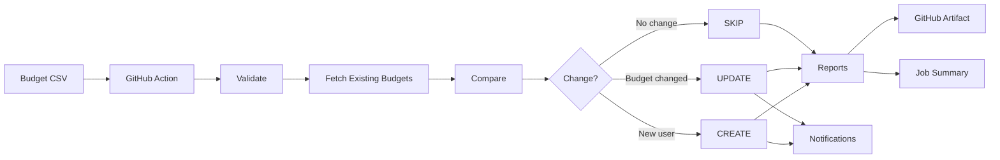

# GitHub Copilot Budget Guardian

GitHub Copilot Budget Guardian is a GitHub Action for managing GitHub Copilot enterprise budgets as code.
Define desired budgets in a CSV file, then let the Action validate data, compare with Enterprise state, apply CREATE or UPDATE changes when needed, SKIP unchanged users, generate audit reports, and optionally notify administrators.

[](https://github.com/xebia-playground/GitHub-Copilot-Budget-Guardian/actions/workflows/test.yml)
[](LICENSE)
[](https://github.com/xebia-playground/GitHub-Copilot-Budget-Guardian/releases)

## Key Capabilities

- **CSV-driven budget management** — Define budgets in version-controlled code
- **Validation** — Automatic data quality checks before any API calls
- **Safe comparison** — Fetches all existing Enterprise budgets with automatic pagination
- **Intelligent synchronization** — CREATE, UPDATE, or SKIP based on Enterprise state
- **Dry-run mode** — Validate changes before executing in production
- **Comprehensive audit reports** — Per-user synchronization results in multiple formats
- **GitHub Job Summary** — Clear visual feedback in workflow run overview
- **Optional notifications** — Email, Slack, and Teams alerts (Email, Slack, Teams)
- **Production-ready** — Designed for enterprise-scale deployments with safety guarantees

## Why Use It?

Managing Copilot budgets manually is repetitive and hard to audit.
This Action makes budget operations predictable, reviewable, and repeatable in CI.

Without automation:
> CSV or ticket request → Admin checks current budgets manually → Manual changes in Enterprise settings → Manual verification → Manual reporting

With GitHub Copilot Budget Guardian:
> CSV → Validate → Fetch existing Enterprise budgets → Compare → CREATE / UPDATE / SKIP → Reports + Job Summary → Optional notifications



## What Happens When the Action Runs

1. Reads your budget CSV file.
2. Validates usernames and budget values.
3. Fetches ALL existing Copilot budgets from your Enterprise (with automatic pagination).
4. Compares each CSV row with current Enterprise state.
5. Applies:
   - **CREATE** for a user that does not yet have a budget.
   - **UPDATE** when an existing budget amount is different.
   - **SKIP** when the budget already matches.
6. Captures any per-user API failures in failed results.
7. Generates three audit reports (Markdown, JSON, CSV) with per-user synchronization results.
8. Writes a GitHub Job Summary with totals and per-user status.
9. Sends optional Email, Slack, and Teams notifications (if configured).

## Prerequisites

- A GitHub repository where this Action runs.
- GitHub Enterprise with Copilot budget API access.
- A Personal Access Token with Enterprise budget management permissions.
- A budget CSV file committed to your repository.

## Quick Start (Recommended: Start with Dry Run)

1. **Prepare your CSV file** (`budgets.csv`):
   ```csv
   username,budget,team,reason
   alice,50,Engineering,Q1 allocation
   bob,100,Platform,Premium user
   ```

2. **Add repository secrets** (Settings → Secrets and Variables → Actions):
   - `ENTERPRISE_ADMIN_PAT` — Your GitHub Personal Access Token
   - `ENTERPRISE_SLUG` — Your GitHub Enterprise slug

3. **Create a workflow file** (`.github/workflows/copilot-budget-sync.yml`):
   ```yaml
   name: Copilot Budget Sync

   on:
     workflow_dispatch:

   permissions:
     contents: read

   jobs:
     sync:
       runs-on: ubuntu-latest
       steps:
         - uses: actions/checkout@v4

         - name: Copilot Budget Guardian (Dry Run)
           id: guardian
           uses: xebia-playground/GitHub-Copilot-Budget-Guardian@v1.0.0
           with:
             github-token: ${{ secrets.ENTERPRISE_ADMIN_PAT }}
             enterprise-slug: ${{ secrets.ENTERPRISE_SLUG }}
             budget-file: budgets.csv
             dry-run: "true"

         - name: Upload reports
           uses: actions/upload-artifact@v4
           with:
             name: budget-sync-report
             path: artifacts/
             retention-days: 7
   ```

4. **Run the workflow**: Go to Actions → Copilot Budget Sync → Run workflow.

5. **Review the results**:
   - Check the Job Summary in the workflow run for an overview.
   - Download the `budget-sync-report` artifact to review detailed reports.

6. **Switch to production** (when confident):
   - Change `dry-run: "true"` to `dry-run: "false"`.
   - Re-run the workflow to apply actual budget changes.

## Production Workflow Checklist

```
1. ✓ Prepare CSV file with desired budgets
2. ✓ Configure GitHub repository secrets (PAT, Enterprise slug)
3. ✓ Create workflow with dry-run: "true"
4. ✓ Run workflow and review Job Summary
5. ✓ Download and review artifacts/budget-report.md
6. ✓ Verify Enterprise configuration and intended changes
7. ✓ Obtain required approval (if applicable)
8. ✓ Update workflow with dry-run: "false"
9. ✓ Run workflow to apply budget changes
10. ✓ Review final audit report
```

## Detailed Configuration

### GitHub Token and Permissions

The `github-token` input requires a Personal Access Token (PAT) with the `manage_billing:copilot` scope for your GitHub Enterprise account.

**Permission requirements:**
- Read existing Copilot budgets from your Enterprise
- Create new budgets
- Update existing budgets

The Action requires at minimum these GitHub API permissions:
- `GET /enterprises/{enterprise}/settings/billing/budgets` — List existing budgets
- `POST /enterprises/{enterprise}/settings/billing/budgets` — Create budgets
- `PATCH /enterprises/{enterprise}/settings/billing/budgets/{budget_id}` — Update budgets

### Budget CSV Format

Your CSV file must have the following structure:

```csv
username,budget,team,reason
alice,50,Engineering,Q1 allocation
bob,100,Platform,Premium user
carol,25,Marketing,Standard plan
```

**Column definitions:**

| Column | Required | Type | Purpose | Effect on GitHub |
|--------|----------|------|---------|------------------|
| `username` | Yes | String | GitHub username | Used to identify the user in GitHub Enterprise |
| `budget` | Yes | Number | Numerical budget amount (units depend on GitHub's pricing) | Sent to GitHub API as `budget_amount` |
| `team` | No | String | Team or department label for reporting | Used in audit reports only; does NOT affect GitHub configuration |
| `reason` | No | String | Context or explanation for reporting | Used in audit reports only; does NOT affect GitHub configuration |

**Important:** The `team` and `reason` columns are purely for local audit/reporting purposes. They do not change GitHub Enterprise configuration.

### Budget Amount Semantics

The `budget` column value is sent to the GitHub Copilot budget API as `budget_amount` with the following characteristics:

- **Unit:** The exact unit depends on GitHub's Copilot billing model (e.g., USD, tokens, requests, or a pricing bundle unit).
- **Product SKU:** This Action currently uses `premium_requests` as the default product SKU.
- **Scope:** All budgets are created/updated as `user`-scoped budgets (per individual user).
- **Type:** All budgets are created/updated as `BundlePricing` type.
- **Further usage prevention:** By default, budgets prevent further usage when exhausted (`prevent_further_usage: true`).

### GitHub Actions Workflow Permissions

Your workflow must have appropriate permissions. The example workflow uses:

```yaml
permissions:
  contents: read
```

This permission allows the Action to:
- Checkout your repository (read the budget CSV file)
- Read your workflow configuration

**Artifact upload:** The example uses `actions/upload-artifact@v4`, which requires default GitHub Actions workflow permissions. Most workflows have this enabled by default.

### Required and Optional Secrets

Store secrets in GitHub Secrets (Settings → Secrets and Variables → Actions).

| Secret | Required | Purpose |
|--------|----------|---------|
| `ENTERPRISE_ADMIN_PAT` | Yes | GitHub PAT with `manage_billing:copilot` scope |
| `ENTERPRISE_SLUG` | Yes | Your GitHub Enterprise slug (e.g., `my-enterprise`) |
| `ADMIN_NOTIFICATION_EMAILS` | Optional | Comma-separated email addresses for email notifications |
| `SMTP_HOST` | Optional | SMTP server hostname (required for email notifications) |
| `SMTP_PORT` | Optional | SMTP server port (defaults to 587 if not provided) |
| `SMTP_USER` | Optional | SMTP authentication username |
| `SMTP_PASSWORD` | Optional | SMTP authentication password |
| `SLACK_WEBHOOK` | Optional | Slack incoming webhook URL for Slack notifications |
| `TEAMS_WEBHOOK` | Optional | Microsoft Teams incoming webhook URL for Teams notifications |

If optional notification secrets are missing, synchronization still completes without errors.

## Dry Run vs Production Mode

### Dry Run Mode (`dry-run: "true"`)

In dry-run mode, the Action:
- ✅ Validates your CSV file
- ✅ Fetches existing budgets from your Enterprise
- ✅ Compares CSV with existing Enterprise state
- ✅ Generates reports with intended changes
- ✅ Publishes Job Summary
- ❌ Does NOT apply any budget changes
- ❌ Does NOT send notifications

**Use dry-run to:** Preview all intended changes before committing to production changes.

### Production Mode (`dry-run: "false"`)

In production mode, the Action:
- ✅ Validates your CSV file
- ✅ Fetches existing budgets from your Enterprise
- ✅ Compares CSV with existing Enterprise state
- ✅ Creates budgets for new users
- ✅ Updates budgets for users with changed amounts
- ✅ Skips users with unchanged budgets
- ✅ Generates audit reports
- ✅ Publishes Job Summary
- ✅ Sends notifications (if configured)

**Important:** Before running with `dry-run: "false"`, always test with `dry-run: "true"` first.

## Reports and Audit Trail

Each Action run generates three audit reports in the `artifacts/` directory:

### budget-report.md (Markdown)
Human-readable report showing:
- Summary statistics (created, updated, skipped, failed counts)
- Per-user synchronization results with status (CREATED, UPDATED, SKIPPED, FAILED)
- Original budget input data for reference

**Download location:** GitHub Actions Artifacts → `budget-sync-report` → `budget-report.md`

### budget-report.json (JSON)
Machine-readable structured report for integration with other tools:
- Summary object with counts and generation timestamp
- Synchronization results array with per-user status and error details
- Original budget input data

**Download location:** GitHub Actions Artifacts → `budget-sync-report` → `budget-report.json`

### budget-report.csv (CSV)
Spreadsheet-compatible export showing:
- Username
- Action (CREATED, UPDATED, SKIPPED, FAILED)
- Requested budget amount
- Previous budget amount (for UPDATED only)
- Error message (for FAILED only)

**Download location:** GitHub Actions Artifacts → `budget-sync-report` → `budget-report.csv`

## GitHub Job Summary

The Action publishes a summary to the GitHub workflow run overview showing:
- Repository context
- Enterprise identifier
- Workflow name
- Execution timestamp
- Summary counts (created, updated, skipped, failed)
- Per-user status table with budget comparisons

View the Job Summary:
1. Go to your workflow run
2. Scroll to the "Summary" section at the top of the run details
3. View the "GitHub Copilot Budget Guardian — Synchronization Report" section

## Inputs

| Input | Required | Default | Description |
|-------|----------|---------|-------------|
| `github-token` | Yes | — | GitHub Personal Access Token with Enterprise permissions |
| `enterprise-slug` | Yes | — | GitHub Enterprise slug |
| `budget-file` | No | `budgets.csv` | Path to the CSV file (relative to repository root) |
| `dry-run` | No | `false` | Set to `"true"` to preview changes without applying them |
| `slack-webhook` | No | — | Slack incoming webhook URL (for Slack notifications) |
| `teams-webhook` | No | — | Microsoft Teams incoming webhook URL (for Teams notifications) |
| `notify-on` | No | `changes-only` | Notification policy: `always` or `changes-only` |

## Outputs

The Action publishes the following outputs for use by downstream workflow steps:

| Output | Description |
|--------|-------------|
| `created` | Number of budgets created |
| `updated` | Number of budgets updated |
| `skipped` | Number of budgets skipped |
| `failed` | Number of failed budget operations |

Example usage in a workflow:
```yaml
- name: Check results
  run: |
    echo "Created: ${{ steps.guardian.outputs.created }}"
    echo "Updated: ${{ steps.guardian.outputs.updated }}"
    echo "Skipped: ${{ steps.guardian.outputs.skipped }}"
    echo "Failed: ${{ steps.guardian.outputs.failed }}"
```

## Notifications

Notification channels are optional. If configured, they deliver summaries of synchronization results.

### Email Notifications

Send email notifications to Enterprise administrators.

**Requirements:**
- `ADMIN_NOTIFICATION_EMAILS` secret (comma-separated email addresses)
- `SMTP_HOST` secret (SMTP server hostname)
- `SMTP_PORT` secret (optional, defaults to 587)
- `SMTP_USER` secret (SMTP authentication username)
- `SMTP_PASSWORD` secret (SMTP authentication password)

**Example workflow with email:**
```yaml
- name: Run Budget Guardian with Notifications
  uses: xebia-playground/GitHub-Copilot-Budget-Guardian@v1.0.0
  with:
    github-token: ${{ secrets.ENTERPRISE_ADMIN_PAT }}
    enterprise-slug: ${{ secrets.ENTERPRISE_SLUG }}
    budget-file: budgets.csv
    dry-run: "false"
    notify-on: changes-only
  env:
    SMTP_HOST: ${{ secrets.SMTP_HOST }}
    SMTP_PORT: ${{ secrets.SMTP_PORT }}
    SMTP_USER: ${{ secrets.SMTP_USER }}
    SMTP_PASSWORD: ${{ secrets.SMTP_PASSWORD }}
    ADMIN_NOTIFICATION_EMAILS: ${{ secrets.ADMIN_NOTIFICATION_EMAILS }}
```

### Slack Notifications

Send notifications to a Slack channel.

**Requirements:**
- `slack-webhook` input with a valid Slack incoming webhook URL
- Webhook must be HTTPS and valid for your Slack workspace

**Example workflow:**
```yaml
- name: Run Budget Guardian with Slack Notifications
  uses: xebia-playground/GitHub-Copilot-Budget-Guardian@v1.0.0
  with:
    github-token: ${{ secrets.ENTERPRISE_ADMIN_PAT }}
    enterprise-slug: ${{ secrets.ENTERPRISE_SLUG }}
    budget-file: budgets.csv
    dry-run: "false"
    notify-on: changes-only
    slack-webhook: ${{ secrets.SLACK_WEBHOOK }}
```

### Microsoft Teams Notifications

Send notifications to a Teams channel.

**Requirements:**
- `teams-webhook` input with a valid Teams incoming webhook URL
- Webhook must be HTTPS and valid for your Teams workspace

**Example workflow:**
```yaml
- name: Run Budget Guardian with Teams Notifications
  uses: xebia-playground/GitHub-Copilot-Budget-Guardian@v1.0.0
  with:
    github-token: ${{ secrets.ENTERPRISE_ADMIN_PAT }}
    enterprise-slug: ${{ secrets.ENTERPRISE_SLUG }}
    budget-file: budgets.csv
    dry-run: "false"
    notify-on: changes-only
    teams-webhook: ${{ secrets.TEAMS_WEBHOOK }}
```

### Notification Policies

The `notify-on` input controls when notifications are sent:

- **`changes-only`** (default): Send notifications only when budgets were created, updated, or failed. Skip notifications if no changes occurred.
- **`always`**: Send notifications regardless of whether changes occurred.

**Note:** Notification failures never cause the Action to fail. If a webhook is unreachable or misconfigured, the Action logs the error but continues completing the synchronization.

## Scheduling

Run the Action manually or on a schedule.

**Manual execution:**
```yaml
on:
  workflow_dispatch:
```

**Scheduled execution:**
```yaml
on:
  schedule:
    - cron: "0 6 * * 1"  # Every Monday at 06:00 UTC
```

**On CSV changes:**
```yaml
on:
  push:
    paths:
      - 'budgets.csv'
```

**Combined:**
```yaml
on:
  workflow_dispatch:
  schedule:
    - cron: "0 6 * * 1"
  push:
    paths:
      - 'budgets.csv'
```

## Common Errors and Fixes

- **Invalid PAT permissions**
  - Symptom: "fetch/update failures from Enterprise API" or "403 Forbidden"
  - Fix: Verify your PAT has the `manage_billing:copilot` scope. Regenerate PAT if necessary.

- **Wrong enterprise slug**
  - Symptom: "Unable to retrieve existing Copilot budgets" or "404 Not Found"
  - Fix: Verify `ENTERPRISE_SLUG` matches your GitHub Enterprise identifier.

- **CSV validation failure**
  - Symptom: "Budget validation failed" or "Action fails before synchronization"
  - Fix: Ensure each row has a `username` and numeric `budget` value. Check for duplicate usernames.

- **CSV file not found**
  - Symptom: "Budget file not found" or "ENOENT" error
  - Fix: Verify the `budget-file` path is correct and the file exists in your repository root.

- **CSV encoding issues**
  - Symptom: Action fails with parsing errors or displays corrupted characters
  - Fix: Ensure your CSV file is saved in UTF-8 encoding.

- **Reports not found in artifact**
  - Symptom: Missing report files after run
  - Fix: Ensure your workflow includes the artifact upload step with `path: artifacts/`.

- **Notification not sent**
  - Symptom: No Email/Slack/Teams message received
  - Fix: Verify webhook URLs are complete and valid. For email, verify SMTP credentials.

- **Webhook URL format error**
  - Symptom: Slack or Teams notification fails with "invalid URL" error
  - Fix: Verify webhook URLs are complete HTTPS URLs and valid from your Slack/Teams workspace.

- **GitHub API rate limiting**
  - Symptom: Action fails with "API rate limit exceeded" after multiple runs
  - Fix: GitHub API has rate limits. Space out workflow executions or reduce frequency.

- **Workflow permissions error**
  - Symptom: GitHub Actions report permission denied when uploading artifacts
  - Fix: Ensure workflow has `permissions: { contents: read }` or necessary artifact upload permissions.

- **Fetching existing budgets failed (production mode)**
  - Symptom: Action fails immediately with "Unable to retrieve existing Copilot budgets"
  - Fix: Verify Enterprise connectivity and PAT validity. Retry the workflow. Contact GitHub support if Enterprise API is unavailable.

## Limitations

- **Budget fetching:** The Action fetches all existing budgets with automatic pagination (no limit on number of users).
- **Notification delivery:** Email, Slack, and Teams notifications are best-effort. External service unavailability or misconfiguration does not fail the Action.
- **Dry-run scope:** Dry-run mode validates your CSV and compares with Enterprise state, but does not test SMTP connectivity or webhook URLs. Validate external notification configuration separately if needed.
- **Budget deletion:** This Action does not delete or remove budgets. Use GitHub Enterprise UI or API directly for budget removal.
- **Concurrent runs:** Running multiple instances of this Action concurrently against the same Enterprise may produce race conditions. Use workflow concurrency controls if needed.

## Security

- **Keep all credentials in GitHub Secrets** — Never commit PATs, SMTP passwords, or webhook URLs to your repository.
- **Use dedicated PAT** — Create a dedicated Personal Access Token for this Action with only the required `manage_billing:copilot` scope.
- **Secure webhook URLs** — Use HTTPS webhook URLs only. Verify webhook URLs are valid and belong to your Slack/Teams workspace.
- **Audit trail** — Retain audit reports and Job Summaries for compliance and troubleshooting.
- **No secrets in reports** — Audit reports never include PATs, tokens, or SMTP credentials.

## Contributing

See [CONTRIBUTING.md](CONTRIBUTING.md).

## License

MIT. See [LICENSE](LICENSE).


Each run generates:

- artifacts/budget-report.csv
- artifacts/budget-report.json
- artifacts/budget-report.md

Where to download after a run:

Actions
-> Workflow run
-> Artifacts
-> budget-sync-report

### What each report contains

- budget-report.csv: tabular export for spreadsheets and downstream automation.
- budget-report.json: structured summary and budget records for integrations.
- budget-report.md: human-readable report for quick review.

## Job summary

The workflow step summary includes:

- Repository
- Enterprise
- Workflow
- Execution Time
- Created / Updated / Skipped / Failed counts
- Changed users table with status and budget comparison

## Inputs

Inputs are sourced from action.yml.

| Input | Required | Default | Description |
|---|---|---|---|
| github-token | Yes | - | GitHub PAT with Enterprise permissions |
| enterprise-slug | Yes | - | GitHub Enterprise slug |
| budget-file | No | budgets.csv | Path to the CSV file |
| dry-run | No | false | Preview mode (no write operations) |
| slack-webhook | No | - | Slack incoming webhook URL |
| teams-webhook | No | - | Teams incoming webhook URL |
| notify-on | No | changes-only | Notification policy: always or changes-only |

## Outputs

| Output | Description |
|---|---|
| created | Number of budgets created |
| updated | Number of budgets updated |
| skipped | Number of budgets skipped |
| failed | Number of failed budget operations |

## Notifications

Notification channels are optional:

- Email via SMTP (recipients from ADMIN_NOTIFICATION_EMAILS)
- Microsoft Teams via teams-webhook
- Slack via slack-webhook

### Optional notification configuration example

```yaml
- name: Run Budget Guardian with notifications
  uses: xebia-playground/GitHub-Copilot-Budget-Guardian@main
  with:
    github-token: ${{ secrets.ENTERPRISE_ADMIN_PAT }}
    enterprise-slug: ${{ secrets.ENTERPRISE_SLUG }}
    budget-file: budgets.csv
    dry-run: "false"
    notify-on: changes-only
    slack-webhook: ${{ secrets.SLACK_WEBHOOK }}
    teams-webhook: ${{ secrets.TEAMS_WEBHOOK }}
  env:
    SMTP_HOST: ${{ secrets.SMTP_HOST }}
    SMTP_PORT: ${{ secrets.SMTP_PORT }}
    SMTP_USER: ${{ secrets.SMTP_USER }}
    SMTP_PASSWORD: ${{ secrets.SMTP_PASSWORD }}
    ADMIN_NOTIFICATION_EMAILS: ${{ secrets.ADMIN_NOTIFICATION_EMAILS }}
```

### Who receives notifications?

- Email: addresses listed in ADMIN_NOTIFICATION_EMAILS.
- Teams: destination configured by the Teams webhook URL.
- Slack: destination configured by the Slack webhook URL.

### What if notification config is missing?

That channel is skipped gracefully and synchronization continues.
Notification failures do not fail synchronization.

### What if there are no changes?

When notify-on is changes-only and created=0, updated=0, failed=0, notifications are skipped.
Reports and summary are still generated.

## Scheduling

You can run manually or on a schedule.

```yaml
on:
  workflow_dispatch:
  schedule:
    - cron: "0 6 * * 1"  # every Monday at 06:00 UTC
```

## Common errors and fixes

- Invalid PAT permissions
  - Symptom: fetch/update failures from Enterprise API.
  - Fix: use a PAT with required Enterprise budget permissions.

- Wrong enterprise slug
  - Symptom: budgets cannot be fetched.
  - Fix: verify ENTERPRISE_SLUG value.

- CSV validation failure
  - Symptom: action fails before synchronization.
  - Fix: ensure username is present, budget is numeric, usernames are unique.

- Reports not found in artifact
  - Symptom: missing report files after run.
  - Fix: ensure upload step uses path artifacts/.

- Notification not sent
  - Symptom: no Email/Teams/Slack message.
  - Fix: verify channel-specific secrets and webhook values.

- CSV file not found
  - Symptom: action fails with "file not found" or "ENOENT" error.
  - Fix: verify the budget-file path is correct and the file exists in the repository root.

- CSV encoding issues
  - Symptom: action fails with parsing errors or displays corrupted characters.
  - Fix: ensure your CSV file is saved in UTF-8 encoding. Some spreadsheet applications default to other encodings.

- Webhook URL format error
  - Symptom: Slack or Teams notification fails with "invalid URL" or "malformed" error.
  - Fix: verify your webhook URLs are complete HTTPS URLs (not truncated) and valid from your Slack/Teams workspace.

- GitHub API rate limiting
  - Symptom: action fails with "API rate limit exceeded" error after multiple runs.
  - Fix: GitHub API has rate limits. If running frequently, space out executions or reduce workflow frequency.

- Workflow permissions error
  - Symptom: GitHub Actions report permission denied when uploading artifacts.
  - Fix: ensure your workflow has `permissions: { contents: read }` or necessary artifact upload permissions configured.

## Limitations

- **Budget fetching:** The action fetches up to 100 existing budgets per API call. Enterprises with more than 100 users assigned Copilot budgets will only sync the first 100. Plan pagination requirements if your organization exceeds this threshold.

- **Notification delivery:** Email, Slack, and Teams notifications are best-effort. If external services (SMTP, webhooks) are unavailable or misconfigured, notifications will fail gracefully without affecting budget synchronization.

- **Dry-run scope:** Dry-run mode validates your CSV file, compares with existing Enterprise budgets, and generates reports, but does not test SMTP connectivity or webhook URLs. Validate external notification configuration separately if needed.

## Security

- Keep all credentials in GitHub Secrets.
- Never commit PATs, SMTP credentials, or webhook URLs.
- External notifications are optional and can be disabled per workflow.

## Contributing

See CONTRIBUTING.md.

## License

MIT. See LICENSE.
