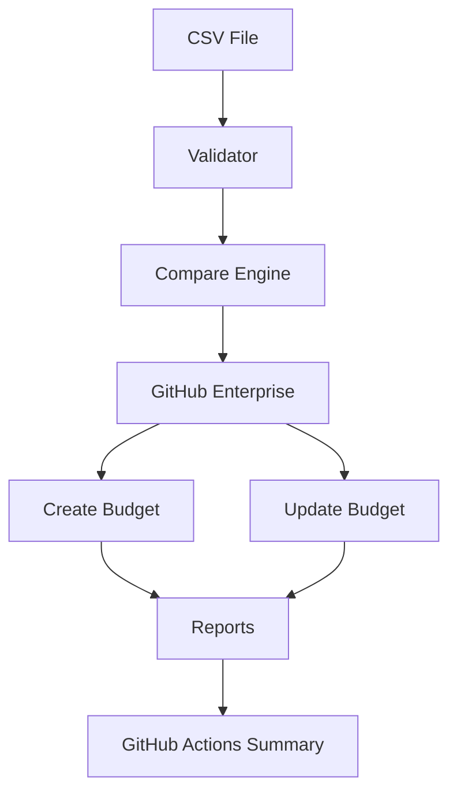

# Architecture Diagram

```mermaid
flowchart TD
    A[CSV File] --> B[Validator]
    B --> C[Compare Engine]
    C --> D[GitHub Enterprise]
    D --> E[Create Budget]
    D --> F[Update Budget]
    E --> G[Reports]
    F --> G[Reports]
    G --> H[GitHub Actions Summary]
```
