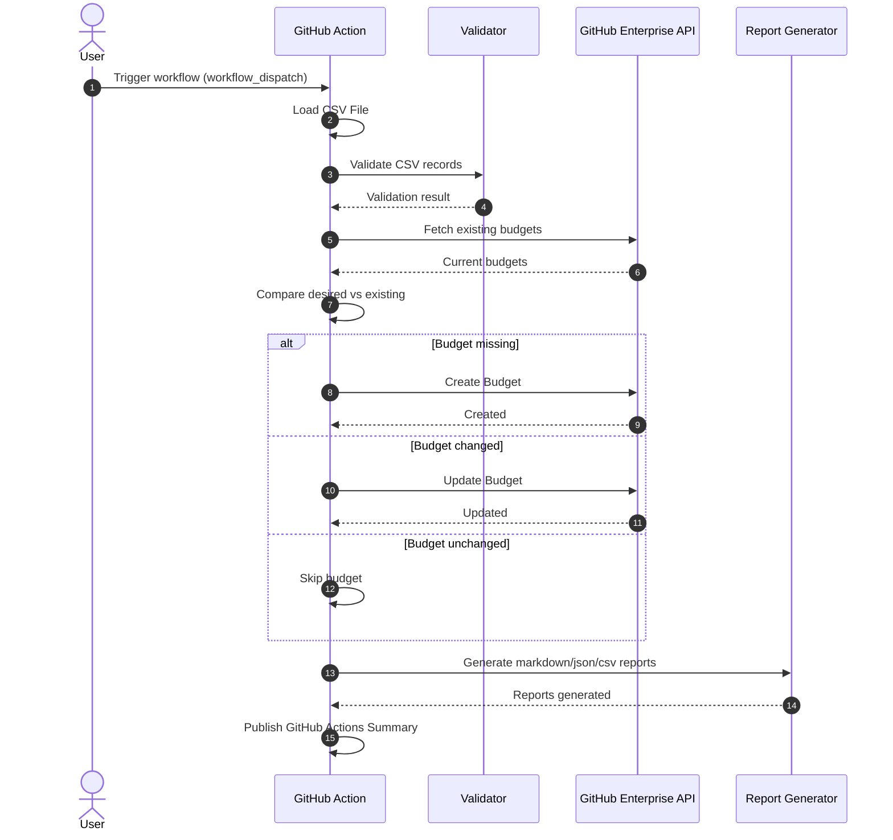

# Sequence Diagram

```mermaid
sequenceDiagram
    autonumber
    actor User
    participant Action as GitHub Action
    participant Validator
    participant API as GitHub Enterprise API
    participant Report as Report Generator

    User->>Action: Trigger workflow (workflow_dispatch)
    Action->>Action: Load CSV File
    Action->>Validator: Validate CSV records
    Validator-->>Action: Validation result

    Action->>API: Fetch existing budgets
    API-->>Action: Current budgets
    Action->>Action: Compare desired vs existing

    alt Budget missing
        Action->>API: Create Budget
        API-->>Action: Created
    else Budget changed
        Action->>API: Update Budget
        API-->>Action: Updated
    else Budget unchanged
        Action->>Action: Skip budget
    end

    Action->>Report: Generate markdown/json/csv reports
    Report-->>Action: Reports generated
    Action->>Action: Publish GitHub Actions Summary
```
